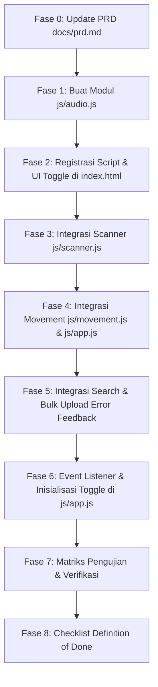

# Task Guide: Implementasi Audio Beep Feedback (Suara Beep Scanner Fisik via Web Audio API)

**Dokumen:** Step-by-Step Task & Implementation Guide  
**Fitur:** Audio Beep Feedback (Suara Beep Scanner Fisik via Browser Web Audio API)  
**Target Pelaksana:** Junior Programmer / AI Agent (Budget-Friendly)  
**Versi Dokumen:** 1.0  
**Tanggal:** 3 September 2026  
**Project:** StockFlow WMS (`muhrobby/StockFlow`)  

---

## Panduan untuk Pelaksana (Junior Programmer / AI Agent)

1. **Dilarang Menebak:** Dokumen ini sengaja dirancang secara **sangat preskriptif**. Semua baris kode, nama file, frekuensi gelombang suara (Hz), durasi millisecond, dan manipulasi DOM sudah dituliskan secara lengkap dan siap pakai. Jangan berasumsi atau mengubah arsitektur.
2. **Wajib Web Audio API Murni (0KB Asset / Tanpa MP3):** Jangan menambahkan file aset audio seperti `.mp3`, `.wav`, atau `.ogg`, dan jangan menginstal library audio pihak ketiga (misalnya Howler.js). Seluruh suara dihasilkan secara instan melalui browser Web Audio API sintetis (`window.AudioContext`).
3. **Pahami Browser Autoplay Policy:** Browser modern di smartphone (khususnya Android Chrome dan iOS Safari) memblokir audio otomatis jika belum ada interaksi pengguna (*user gesture*). Modul audio harus memiliki listener pembuka kunci (*audio unlock listener*) pada interaksi pertama (`touchstart` / `click`).
4. **Non-Blocking & Fail-Safe:** Pemutaran audio tidak boleh menghentikan thread aplikasi atau menyebabkan crash jika Web Audio API diblokir perangkat atau tidak didukung. Semua pemanggilan audio dibungkus dalam `try-catch` atau *optional chaining* (`AudioFeedback?.playSuccess()`).
5. **Preservasi Fitur Eksisting:** Jangan menghapus getaran haptic (`navigator.vibrate`) atau notifikasi toast yang sudah ada. Audio feedback bekerja **berdampingan secara multimodal** dengan haptic dan UI feedback.

---

## Latar Belakang & Masalah Lapangan

- **Kondisi Lapangan:** Gudang logistik merupakan area kerja yang bising (suara forklift, conveyor, dan boks barang). Selain itu, operator sering kali mengenakan sarung tangan kerja pelindung tebal sehingga getaran getar (*haptic feedback*) dari smartphone sering kali tidak terasa di tangan.
- **Dampak Buruk:** Operator terpaksa memandangi layar HP terus-menerus setiap kali melakukan scan barang untuk memastikan apakah barcode terbaca atau transaksi movement berhasil. Hal ini memperlambat ritme kerja.
- **Solusi:** Menambahkan audio sintetis instan yang meniru perilaku **scanner barcode fisik industri** (Honeywell/Zebra):
  - **Beep Tinggi (Crisp Tone):** Berbunyi seketika saat barcode sukses terbaca oleh kamera atau movement berhasil dicatat.
  - **Double Buzz Rendah:** Berbunyi saat scan gagal, barang tidak ditemukan di database, atau transaksi ditolak server/stok tidak cukup.
- **Hasil Akhir:** Operator dapat bekerja lebih cepat, baik menggunakan speaker smartphone maupun headset bluetooth/earphone berkabel, cukup mengandalkan telinga tanpa harus selalu menatap layar.

---

## Spesifikasi Akustik & Karakteristik Suara

Sistem menghasilkan 2 jenis suara sintetis tanpa memerlukan unduhan jaringan:

| Tipe Suara | Skenario Pemakaian | Frekuensi | Tipe Gelombang | Durasi & Pola Amplifikasi | Karakter Suara |
| :--- | :--- | :--- | :--- | :--- | :--- |
| **Beep Tinggi** (*Success Tone*) | • Barcode berhasil dibaca kamera.<br>• Movement (IN/OUT/MOVE) berhasil disimpan.<br>• Quick Movement berhasil dicatat.<br>• Bulk upload sukses 100%. | 1800 Hz | `sine` (Sinus murni) | **110 ms**<br>• Attack: Instan (Volume 0.35)<br>• Decay: Eksponensial turun ke 0.001 dalam 0.11 detik | Nada tinggi renyah, tajam menembus kebisingan gudang, persis scanner fisik Honeywell. |
| **Double Buzz Rendah** (*Error Tone*) | • Barang tidak ditemukan di database.<br>• Barcode kamera tidak valid / error.<br>• Transaksi movement ditolak server.<br>• Validasi form gagal (stok kurang).<br>• Koneksi offline / server putus. | 160 Hz | `sawtooth` (Gigi gergaji) | **240 ms** (2 pulsa):<br>• Pulsa 1: 0ms - 90ms (Vol 0.35)<br>• Jeda hening: 90ms - 130ms<br>• Pulsa 2: 130ms - 220ms (Vol 0.35) | Nada dengung rendah dan kasar (BUZZ-BUZZ), indikasi jelas bahwa input bermasalah. |

---

## Daftar Berkas yang Terlibat

| File | Status | Peran & Tanggung Jawab |
| :--- | :--- | :--- |
| `docs/prd.md` | Modifikasi | Update bab Scope, User Journey, dan Requirement Spesifikasi Fungsional (FR-012). |
| `js/audio.js` | **Baru** | Modul inti Web Audio API, synthesizer suara beep dan buzz, unlocker mobile, serta toggle state. |
| `index.html` | Modifikasi | Menambahkan tag script `js/audio.js` dan tombol toggle audio di Header Navbar. |
| `js/scanner.js` | Modifikasi | Memanggil `playSuccess()` saat barcode terbaca oleh kamera. |
| `js/movement.js` | Modifikasi | Memanggil `playSuccess()` saat movement optimistik dicatat, dan `playError()` saat transaksi ditolak. |
| `js/app.js` | Modifikasi | Memanggil audio pada Quick Movement, error pencarian barang, dan inisialisasi tombol toggle. |
| `js/bulk-upload.js` | Modifikasi | Memanggil audio saat file CSV valid/invalid dan saat proses bulk selesai. |

---

## Rincian Fase Pengerjaan



---

## Fase 0: Pembaruan Dokumen PRD (`docs/prd.md`)

Target Berkas: [`docs/prd.md`](file:///media/muhrobby/DataExternal/Project/warehouse-scanner/docs/prd.md)

Sebelum memulai penulisan kode, perbarui PRD agar ruang lingkup sistem tetap sinkron dan terdokumentasi rapi.

### Instruksi Kerja:

- [x] **0.1. Perbarui Bab 4.1 (In Scope)**  
  Buka `docs/prd.md`, temukan bagian `## 4.1 In Scope`. Tambahkan poin berikut di akhir daftar:
  ```markdown
  - Audio Beep Feedback (Web Audio API sintetis instan 0KB tanpa file MP3).
  - High Beep Tone (1800 Hz) untuk validasi sukses scan barcode dan movement.
  - Low Double Buzz Tone (160 Hz) untuk notifikasi scan gagal, barang tidak ditemukan, atau stok ditolak server.
  - Tombol Audio Mute/Unmute pada header antarmuka dengan persistensi preferensi di LocalStorage.
  ```

- [x] **0.2. Tambahkan User Journey 6.9 di Bab 6**  
  Di bagian akhir Bab 6 (setelah `6.8 Quick Movement from Search`), tambahkan subbab baru `6.9 Audio & Haptic Multimodal Feedback`:
  ````markdown
  ## 6.9 Audio & Haptic Multimodal Feedback
  
  ```text
  Operator Menghubungkan Earphone / Menyalakan Speaker HP
         ↓
  Arahkan Kamera Scanner ke Barcode Barang
         ↓
  Barcode Terbaca Seketika
         ↓
  [BEEP TINGGI 1800Hz + Getaran 120ms]
  Operator tahu barcode berhasil terbaca tanpa harus melihat layar
         ↓
  Pilih Aksi / Submit Movement
         ↓
  Transaksi Diproses Optimistik (0 ms)
         ↓
  • JIKA SUKSES: [BEEP TINGGI 1800Hz + Getaran Pendek] → Lanjut scan barang berikutnya
  • JIKA GAGAL / STOK DITOLAK: [DOUBLE BUZZ RENDAH 160Hz + Getaran Panjang] → Operator cek layar
  ```
  ````

- [x] **0.3. Tambahkan FR-012 di Bab 10**  
  Di akhir Bab 10, tambahkan spesifikasi fungsional baru:
  ```markdown
  ---

  ## FR-012 Audio Beep Feedback (Suara Beep Scanner Fisik)

  Sistem menyediakan feedback audio sintetis menggunakan Web Audio API browser untuk memfasilitasi operasional "eyes-free" di lingkungan gudang yang bising.

  ### Aturan Fungsional:
  1. Suara dibangkitkan secara lokal melalui browser `AudioContext` tanpa mengunduh file media eksternal (0 KB asset transfer).
  2. **Beep Sukses:** Frekuensi 1800 Hz sine wave dengan envelope durasi 110ms dibunyikan saat:
     - Kamera berhasil membaca barcode.
     - Transaksi movement (IN, OUT, MOVE) berhasil dicatat.
     - Transaksi Quick Movement berhasil dicatat.
  3. **Buzz Gagal:** Frekuensi 160 Hz sawtooth wave dengan pola double burst (2 x 90ms) dibunyikan saat:
     - Barcode tidak terbaca atau format salah.
     - Pencarian barang menghasilkan "Barang tidak ditemukan".
     - Validasi pergerakan gagal (misal: Qty melebihi stok yang ada).
     - Transaksi ditolak oleh server atau koneksi jaringan putus.
  4. Menyediakan kontrol toggle (Mute/Unmute) di Header UI yang menyimpan status ke `localStorage`.
  5. Sistem otomatis membuka kunci (*unlock*) `AudioContext` pada sentuhan/interaksi pertama pengguna untuk mematuhi kebijakan autoplay browser mobile.
  ```

---

## Fase 1: Pembuatan Utilitas Audio (`js/audio.js`)

Target Berkas: Buat berkas baru [`js/audio.js`](file:///media/muhrobby/DataExternal/Project/warehouse-scanner/js/audio.js)

Kita akan membuat modul mandiri menggunakan pola *Revealing Module Pattern* (IIFE) yang membungkus seluruh logika Web Audio API.

### Instruksi Kerja:

- [x] **1.1. Buat Berkas Baru `js/audio.js`**  
  Tuliskan kode berikut secara lengkap ke dalam `js/audio.js`:

```javascript
/**
 * AudioFeedback — Synthesizer Feedback Audio untuk StockFlow WMS
 * Menghasilkan feedback suara instan meniru scanner fisik Honeywell/Zebra
 * Menggunakan Web Audio API sintetis (0 KB asset, tanpa file MP3/WAV eksternal)
 */
const AudioFeedback = (function () {
  'use strict';

  const STORAGE_KEY = 'stockflow_audio_enabled';

  // Shared AudioContext (Singleton untuk mencegah batas AudioContext browser terlampaui)
  let audioCtx = null;

  // Baca preferensi tersimpan, default: true (aktif)
  let isEnabled = localStorage.getItem(STORAGE_KEY) !== 'false';

  /**
   * Mendapatkan instance AudioContext yang aktif dan aman untuk semua browser.
   */
  function getAudioContext() {
    if (!audioCtx) {
      const AudioContextClass = window.AudioContext || window.webkitAudioContext;
      if (AudioContextClass) {
        audioCtx = new AudioContextClass();
      }
    }

    // Bangunkan konteks jika dalam status 'suspended' akibat Autoplay Policy browser
    if (audioCtx && audioCtx.state === 'suspended') {
      audioCtx.resume().catch((err) => {
        console.warn('[AudioFeedback] Gagal me-resume AudioContext:', err);
      });
    }

    return audioCtx;
  }

  /**
   * Listener pembuka kunci (unlocker) untuk mobile browser (iOS Safari & Android Chrome)
   * Berjalan otomatis saat ada event sentuhan atau klik pertama pengguna.
   */
  function initAutoplayUnlocker() {
    const unlockEvents = ['touchstart', 'touchend', 'click', 'keydown'];

    function handleFirstGesture() {
      const ctx = getAudioContext();
      if (ctx && ctx.state === 'running') {
        // Jika sudah aktif, lepas semua listener
        unlockEvents.forEach((evt) => {
          document.removeEventListener(evt, handleFirstGesture, true);
        });
      }
    }

    unlockEvents.forEach((evt) => {
      document.addEventListener(evt, handleFirstGesture, { capture: true, passive: true });
    });
  }

  /**
   * Membunyikan BEEP TINGGI (Crisp High Tone)
   * Frekuensi: 1800 Hz | Waveform: Sine | Durasi: ~110 ms
   * Dipakai saat: Scan barcode sukses, Movement sukses.
   */
  function playSuccess() {
    if (!isEnabled) return;

    try {
      const ctx = getAudioContext();
      if (!ctx) return;

      const now = ctx.currentTime;
      const osc = ctx.createOscillator();
      const gain = ctx.createGain();

      osc.type = 'sine';
      osc.frequency.setValueAtTime(1800, now);

      // Envelope: Mulai volume 0.35, meluruh eksponensial ke 0.001 dalam 0.11 detik
      gain.gain.setValueAtTime(0.35, now);
      gain.gain.exponentialRampToValueAtTime(0.001, now + 0.11);

      osc.connect(gain);
      gain.connect(ctx.destination);

      osc.start(now);
      osc.stop(now + 0.11);

      // Putus sambungan node setelah selesai guna mencegah kebocoran memori
      setTimeout(() => {
        try {
          osc.disconnect();
          gain.disconnect();
        } catch (_) {}
      }, 150);
    } catch (err) {
      console.warn('[AudioFeedback] Gagal memutar nada sukses:', err);
    }
  }

  /**
   * Membunyikan DOUBLE BUZZ RENDAH (Harsh Double Buzzer)
   * Frekuensi: 160 Hz | Waveform: Sawtooth | Pola: 2 pulsa (BUZZ - gap - BUZZ)
   * Dipakai saat: Scan gagal, barang tidak ditemukan, stok ditolak server.
   */
  function playError() {
    if (!isEnabled) return;

    try {
      const ctx = getAudioContext();
      if (!ctx) return;

      const now = ctx.currentTime;
      const osc = ctx.createOscillator();
      const gain = ctx.createGain();

      osc.type = 'sawtooth'; // Gelombang gergaji menghasilkan nada berdengung kasar
      osc.frequency.setValueAtTime(160, now);

      // Pola Double Buzz:
      // 0.00s - 0.09s : Pulsa 1 (Volume 0.35 -> 0.01)
      // 0.09s - 0.13s : Diam (Volume 0.00)
      // 0.13s - 0.22s : Pulsa 2 (Volume 0.35 -> 0.001)
      gain.gain.setValueAtTime(0.35, now);
      gain.gain.exponentialRampToValueAtTime(0.01, now + 0.09);

      gain.gain.setValueAtTime(0, now + 0.09);
      gain.gain.setValueAtTime(0.35, now + 0.13);
      gain.gain.exponentialRampToValueAtTime(0.001, now + 0.22);

      osc.connect(gain);
      gain.connect(ctx.destination);

      osc.start(now);
      osc.stop(now + 0.23);

      setTimeout(() => {
        try {
          osc.disconnect();
          gain.disconnect();
        } catch (_) {}
      }, 300);
    } catch (err) {
      console.warn('[AudioFeedback] Gagal memutar nada error:', err);
    }
  }

  /**
   * Mengambil status audio saat ini
   */
  function isAudioEnabled() {
    return isEnabled;
  }

  /**
   * Mengubah status aktif/hening audio (Toggle)
   */
  function toggleAudio() {
    setAudioEnabled(!isEnabled);
    return isEnabled;
  }

  /**
   * Mengatur status aktif/hening secara eksplisit
   */
  function setAudioEnabled(enabled) {
    isEnabled = Boolean(enabled);
    localStorage.setItem(STORAGE_KEY, isEnabled ? 'true' : 'false');
    updateToggleUI();

    // Bunyikan nada uji coba singkat jika diaktifkan
    if (isEnabled) {
      playSuccess();
    }
  }

  /**
   * Sinkronkan tampilan visual tombol di Header UI
   */
  function updateToggleUI() {
    const btn = document.getElementById('btnToggleAudio');
    const icon = document.getElementById('audioIcon');
    if (!btn || !icon) return;

    if (isEnabled) {
      btn.classList.remove('text-slate-400', 'bg-slate-50');
      btn.classList.add('text-slate-600', 'bg-slate-100');
      btn.setAttribute('title', 'Suara Beep: Aktif (Klik untuk bisukan)');
      btn.setAttribute('aria-label', 'Suara Beep Aktif');
      icon.setAttribute('data-lucide', 'volume-2');
    } else {
      btn.classList.remove('text-slate-600', 'bg-slate-100');
      btn.classList.add('text-slate-400', 'bg-slate-100');
      btn.setAttribute('title', 'Suara Beep: Hening (Klik untuk bunyikan)');
      btn.setAttribute('aria-label', 'Suara Beep Hening');
      icon.setAttribute('data-lucide', 'volume-x');
    }

    if (window.lucide) {
      lucide.createIcons();
    }
  }

  // Pasang listener pembuka kunci secara otomatis saat script dimuat
  initAutoplayUnlocker();

  return {
    playSuccess,
    playBeep: playSuccess,
    playError,
    playBuzz: playError,
    isAudioEnabled,
    toggleAudio,
    setAudioEnabled,
    updateToggleUI,
    unlock: getAudioContext
  };
})();

// Lampirkan ke global window
window.AudioFeedback = AudioFeedback;
```

---

## Fase 2: Registrasi Script & Markup UI Header (`index.html`)

Target Berkas: [`index.html`](file:///media/muhrobby/DataExternal/Project/warehouse-scanner/index.html)

Kita perlu memasang tombol kontrol audio di Header dan menyisipkan berkas `js/audio.js`.

### Instruksi Kerja:

- [x] **2.1. Tambahkan Tombol Toggle Audio pada Header**  
  Buka `index.html`. Cari elemen tombol notifikasi `#btnOpenSyncTray` di baris ~157. Tepat **sebelum** container notifikasi tersebut (`<!-- Container Lonceng & Dropdown Notifikasi (Nempel) -->`), tambahkan tombol toggle audio berikut:

  ```html
              <!-- Tombol Audio Feedback Scanner (Mute / Unmute) -->
              <button
                id="btnToggleAudio"
                type="button"
                class="flex h-10 w-10 items-center justify-center rounded-xl bg-slate-100 text-slate-600 transition hover:bg-slate-200 active:scale-95"
                aria-label="Suara Beep Aktif"
                title="Suara Beep: Aktif (Klik untuk bisukan)"
              >
                <i id="audioIcon" data-lucide="volume-2" class="h-5 w-5"></i>
              </button>
  ```

  *Struktur lengkap di sekitarnya akan terlihat seperti ini:*
  ```html
              <div class="hidden text-right lg:block">
                <p id="headerUserName" class="text-sm font-bold">PIC</p>
                <p id="headerUserNik" class="text-xs text-slate-400">-</p>
              </div>

              <!-- Tombol Audio Feedback Scanner (Mute / Unmute) -->
              <button
                id="btnToggleAudio"
                type="button"
                class="flex h-10 w-10 items-center justify-center rounded-xl bg-slate-100 text-slate-600 transition hover:bg-slate-200 active:scale-95"
                aria-label="Suara Beep Aktif"
                title="Suara Beep: Aktif (Klik untuk bisukan)"
              >
                <i id="audioIcon" data-lucide="volume-2" class="h-5 w-5"></i>
              </button>

              <!-- Container Lonceng & Dropdown Notifikasi (Nempel) -->
              <div class="relative">
                <button
                  id="btnOpenSyncTray"
  ```

- [x] **2.2. Daftarkan Script `js/audio.js` di Bagian Bawah `index.html`**  
  Gulir ke bawah mendekati baris penutup `</body>` (sekitar baris ~1402). Tambahkan `<script src="./js/audio.js?v=1"></script>` **sebelum** `scanner.js` dan `app.js`:

  ```html
      <script src="./js/config.js?v=4"></script>
      <script src="./js/api.js?v=4"></script>
      <script src="./js/auth.js?v=4"></script>
      <script src="./js/audio.js?v=1"></script>
      <script src="./js/scanner.js?v=5"></script>
      <script src="./js/app.js?v=16"></script>
      <script src="./js/movement.js?v=7"></script>
      <script src="./js/bulk-upload.js?v=1"></script>
  ```

---

## Fase 3: Integrasi Barcode Scanner (`js/scanner.js`)

Target Berkas: [`js/scanner.js`](file:///media/muhrobby/DataExternal/Project/warehouse-scanner/js/scanner.js)

Ketika kamera berhasil memindai barcode fisik, bunyikan **Beep Tinggi** mendahului penutupan modal scanner.

### Instruksi Kerja:

- [x] **3.1. Tambahkan `playSuccess()` pada `onScanSuccess`**  
  Buka `js/scanner.js`, temukan fungsi `onScanSuccess` (sekitar baris ~205-210). Tambahkan pemanggilan audio bersamaan dengan haptic getar:

  ```javascript
      setStatus("Barcode terbaca");

      if (navigator.vibrate) {
        navigator.vibrate(120);
      }

      // Mainkan suara beep renyah scanner fisik
      if (window.AudioFeedback) {
        window.AudioFeedback.playSuccess();
      }

      const callback = successCallback;
  ```

---

## Fase 4: Integrasi Movement & Quick Movement (`js/movement.js` & `js/app.js`)

Target Berkas:
1. [`js/movement.js`](file:///media/muhrobby/DataExternal/Project/warehouse-scanner/js/movement.js)
2. [`js/app.js`](file:///media/muhrobby/DataExternal/Project/warehouse-scanner/js/app.js)

### Instruksi Kerja di `js/movement.js`:

- [x] **4.1. Tambahkan `playSuccess()` pada Optimistic Movement Feedback**  
  Buka `js/movement.js`, cari bagian `handleMovementSubmit` langkah ke-2 (`// 2. OPTIMISTIC FEEDBACK (0 ms)`) sekitar baris ~290:

  ```javascript
    // 2. OPTIMISTIC FEEDBACK (0 ms)
    if (navigator.vibrate) {
      navigator.vibrate([60, 40, 60]);
    }

    // Mainkan Beep Sukses instan
    if (window.AudioFeedback) {
      window.AudioFeedback.playSuccess();
    }
  ```

- [x] **4.2. Tambahkan `playError()` pada Centralized Error Handler `showMovementError`**  
  Di `js/movement.js`, cari fungsi `showMovementError(message)` (sekitar baris ~632). Tambahkan bunyi buzz error agar setiap kesalahan form atau penolakan server memicu suara peringatan:

  ```javascript
  function showMovementError(message) {
    // Bunyikan buzz error jika validasi movement gagal
    if (window.AudioFeedback) {
      window.AudioFeedback.playError();
    }

    const box = document.getElementById('movementError');
    const messageBox = document.getElementById('movementErrorMessage');
  ```

- [x] **4.3. Tambahkan `playError()` pada Offline & Network Error Handler**  
  Di `js/movement.js`, cari blok `sendMovementBackground` bagian `catch` (sekitar baris ~390):

  ```javascript
        if (navigator.vibrate) {
          navigator.vibrate([150, 75, 150]);
        }

        if (window.AudioFeedback) {
          window.AudioFeedback.playError();
        }
  ```

### Instruksi Kerja di `js/app.js` (Quick Movement from Search):

- [x] **4.4. Tambahkan `playSuccess()` pada Quick Movement Submit**  
  Buka `js/app.js`, cari bagian `// 3. INSTANT OPERATOR FEEDBACK (0 ms)` di dalam fungsi `executeQuickMovementSubmit` (sekitar baris ~1793):

  ```javascript
    // =========================================================
    // 3. INSTANT OPERATOR FEEDBACK (0 ms)
    // =========================================================
    if (navigator.vibrate) {
      navigator.vibrate([60, 40, 60]);
    }

    if (window.AudioFeedback) {
      window.AudioFeedback.playSuccess();
    }

    closeQuickMovementModal();
  ```

- [x] **4.5. Tambahkan `playError()` pada Quick Movement Server Rejection & Offline**  
  Di `js/app.js`, cari blok penanganan error `sendMovement()` di dalam `executeQuickMovementSubmit` (sekitar baris ~1850 dan ~1875):

  ```javascript
          if (isNetworkErr) {
            QueueManager.enqueue(payload, backupSearchState);

            if (navigator.vibrate) {
              navigator.vibrate([150, 75, 150]);
            }

            if (window.AudioFeedback) {
              window.AudioFeedback.playError();
            }
            ...
          } else {
            ...
            if (navigator.vibrate) {
              navigator.vibrate([250, 100, 250, 100, 250]);
            }

            if (window.AudioFeedback) {
              window.AudioFeedback.playError();
            }
            ...
          }
  ```

---

## Fase 5: Integrasi Feedback Audio Pencarian & Bulk Upload

Target Berkas:
1. [`js/app.js`](file:///media/muhrobby/DataExternal/Project/warehouse-scanner/js/app.js)
2. [`js/bulk-upload.js`](file:///media/muhrobby/DataExternal/Project/warehouse-scanner/js/bulk-upload.js)

### Instruksi Kerja:

- [x] **5.1. Tambahkan `playError()` saat Barang Tidak Ditemukan di `js/app.js`**  
  Cari fungsi `showSearchError(message)` di `js/app.js` (sekitar baris ~778). Tambahkan pemanggilan buzz error:

  ```javascript
  function showSearchError(message) {
    if (window.AudioFeedback) {
      window.AudioFeedback.playError();
    }

    const box = document.getElementById("searchError");

    document.getElementById("searchErrorMessage").textContent = message;

    box.classList.remove("hidden");

    lucide.createIcons();
  }
  ```

- [x] **5.2. Tambahkan Audio Feedback pada `js/bulk-upload.js`**  
  Buka `js/bulk-upload.js`:
  1. Cari fungsi `showError(msg)` (sekitar baris ~158), tambahkan `AudioFeedback.playError()`:
     ```javascript
     function showError(msg) {
       if (window.AudioFeedback) {
         window.AudioFeedback.playError();
       }
       if (!elements.errorAlert || !elements.errorMessage) return;
       elements.errorMessage.textContent = msg;
       elements.errorAlert.classList.remove('hidden');
     }
     ```
  2. Cari fungsi `renderResults(results)` (sekitar baris ~280-305), bunyikan nada sukses atau error sesuai hasil rekonsiliasi CSV:
     ```javascript
       if (failedCount > 0) {
         if (window.AudioFeedback) window.AudioFeedback.playError();
         elements.resultFailBox?.classList.remove('hidden');
         elements.resultSuccessBox?.classList.add('hidden');
         elements.btnDownloadFeedback?.classList.remove('hidden');
         downloadFeedbackCSV(results);
       } else {
         if (window.AudioFeedback) window.AudioFeedback.playSuccess();
         elements.resultFailBox?.classList.add('hidden');
         elements.resultSuccessBox?.classList.remove('hidden');
         elements.btnDownloadFeedback?.classList.add('hidden');
       }
     ```

---

## Fase 6: Event Listener & Inisialisasi Toggle di `js/app.js`

Target Berkas: [`js/app.js`](file:///media/muhrobby/DataExternal/Project/warehouse-scanner/js/app.js)

Kaitkan tombol UI `#btnToggleAudio` dengan fungsi toggle dan inisialisasi status ikon saat aplikasi dimuat.

### Instruksi Kerja:

- [x] **6.1. Pasang Event Listener Tombol di `bindEvents()`**  
  Buka `js/app.js`, temukan fungsi `bindEvents()` (sekitar baris ~40-60). Tambahkan listener untuk `#btnToggleAudio`:

  ```javascript
    // Audio Beep Feedback Toggle
    const btnToggleAudio = document.getElementById("btnToggleAudio");
    if (btnToggleAudio) {
      btnToggleAudio.addEventListener("click", () => {
        if (window.AudioFeedback) {
          const newState = window.AudioFeedback.toggleAudio();
          showToast(newState ? "Suara beep diaktifkan" : "Suara beep dimatikan");
        }
      });
    }
  ```

- [x] **6.2. Panggil Inisialisasi Tampilan Ikon di `initApp()`**  
  Di `js/app.js`, temukan fungsi `initApp()` (sekitar baris ~22). Tambahkan panggilan `updateToggleUI()`:

  ```javascript
  function initApp() {
    lucide.createIcons();

    Scanner.init();

    QueueManager.init();

    SyncTracker.init();

    if (window.AudioFeedback) {
      window.AudioFeedback.updateToggleUI();
    }

    bindEvents();

    bootstrap();
  }
  ```

---

## Fase 7: Matriks Pengujian & Skenario Verifikasi

Lakukan pengujian manual di browser (Desktop Chrome & Mobile Device / Device Emulation mode) sesuai matriks berikut:

| No | Aksi / Skenario Uji | Prosedur Uji | Ekspektasi Audio | Ekspektasi Visual / Haptic | Status |
| :---: | :--- | :--- | :--- | :--- | :---: |
| 1 | **Scan Barcode Sukses** | Buka scanner kamera, scan barcode valid (misal: `100001`). | **BEEP Tinggi (1800 Hz)** berbunyi 1x segera setelah frame barcode terkunci. | Getaran haptic 120ms terasa, modal scanner tertutup otomatis, hasil tampil. | [ ] |
| 2 | **Cari SKU Tidak Ditemukan** | Masukkan SKU acak yang tidak ada di master (misal: `999999`), klik Cari. | **DOUBLE BUZZ Rendah (160 Hz)** berbunyi (BUZZ-BUZZ). | Alert merah "Barang tidak ditemukan" muncul. | [ ] |
| 3 | **Movement Form Submit Sukses** | Isi formulir Movement IN/OUT/MOVE secara valid, klik "Simpan Pergerakan". | **BEEP Tinggi (1800 Hz)** berbunyi instan pada 0 ms. | Haptic ganda `[60, 40, 60]`, kartu sukses optimistik hijau muncul, form ter-reset. | [ ] |
| 4 | **Validasi Form Movement Gagal** | Kosongkan kolom Qty atau isi 0, lalu klik "Simpan Pergerakan". | **DOUBLE BUZZ Rendah (160 Hz)** berbunyi. | Alert error form merah muncul, transaksi tidak dikirim ke server. | [ ] |
| 5 | **Quick Movement Sukses** | Pada hasil pencarian barang, klik "Ambil (OUT)", pilih qty, klik Konfirmasi. | **BEEP Tinggi (1800 Hz)** berbunyi instan. | Bottom sheet tertutup, stok di kartu terpotong seketika. | [ ] |
| 6 | **Quick Movement Gagal (Server Rejection)** | Putuskan koneksi internet atau gunakan data stok yang telah usang. | **DOUBLE BUZZ Rendah (160 Hz)** berbunyi saat gagal. | Modal error muncul dengan tombol "Coba Lagi". | [ ] |
| 7 | **Fitur Mute / Unmute** | Klik tombol speaker di header (ikon berubah jadi `volume-x`), ulangi scan barcode. | **TIDAK ADA SUARA** sama sekali (Hening). | Toast "Suara beep dimatikan" tampil, haptic getar tetap berfungsi. | [ ] |
| 8 | **Persistensi LocalStorage** | Refresh halaman browser setelah mematikan suara. | Suara tetap **Hening**; tombol tetap berikon `volume-x`. | Preferensi tersimpan di `localStorage.getItem('stockflow_audio_enabled')`. | [ ] |
| 9 | **Autoplay Policy Unlocker** | Buka web di smartphone dalam mode incognito, sentuh layar pertama kali. | AudioContext berhasil dibuka tanpa error `The AudioContext was not allowed to start` di konsol devtools. | Audio berjalan normal pada aksi berikutnya. | [ ] |
| 10 | **Penggunaan Earphone / Headset** | Pasang headset bluetooth / jack 3.5mm pada HP, jalankan scan. | Suara beep terdengar jernih dan tajam di telinga operator tanpa noise *popping/clipping*. | Operator dapat bekerja secara *eyes-free*. | [ ] |

---

## Fase 8: Checklist Definition of Done (DoD)

Sebelum mengajukan pekerjaan untuk di-merge / selesai, pastikan seluruh kriteria berikut terpenuhi:

- [ ] Berkas `js/audio.js` telah dibuat dan tidak memiliki dependensi pustaka luar (100% native Web Audio API).
- [ ] Tidak ada file MP3/WAV eksternal yang diunduh ke repository.
- [ ] Tombol toggle audio di header responsif dan bekerja pada mode mobile (< 640px) maupun desktop.
- [ ] Status preferensi suara (aktif/hening) tersimpan secara persisten di `localStorage`.
- [ ] Beep tinggi (1800 Hz) bersuara tepat waktu pada scan sukses kamera dan submit movement.
- [ ] Double buzz rendah (160 Hz) bersuara tepat waktu pada barang tidak ditemukan dan transaksi gagal.
- [ ] Tidak ada error unhandled exception atau memory leak saat pemutaran audio berulang kali (node ter-disconnect dengan benar).
- [ ] Aplikasi tetap berjalan normal 100% jika browser pengguna tidak mendukung Web Audio API.
- [ ] Dokumen PRD `docs/prd.md` telah diperbarui mencakup FR-012 dan User Journey 6.9.
